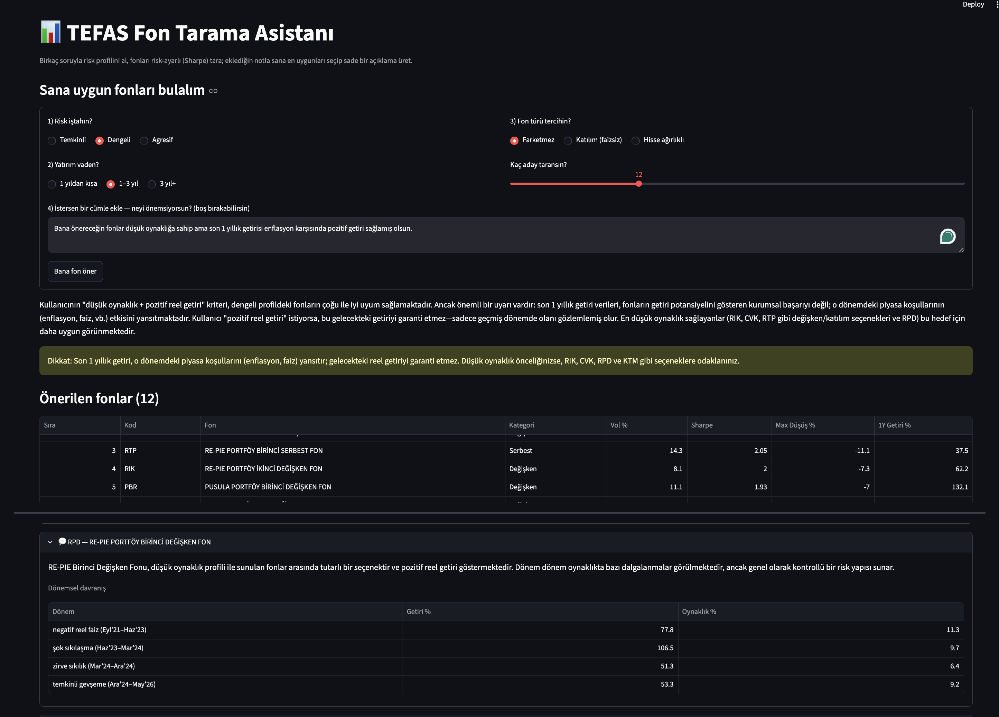

# TEFAS Fund Comparison & Recommendation Assistant

Ranks **852 active Turkish mutual funds** by risk profile, investment horizon, and goal, then explains each recommendation in natural language — with the numbers coming from a deterministic engine, never from the LLM.



> User asks for low volatility + positive real returns. The engine flags a caveat instead of just complying — 1-year returns reflect that period's macro conditions, not guaranteed future performance. Below it, a per-fund explanation panel shows the LLM narrating pre-computed regime data, never generating the numbers itself.

**Live demo:** *add your Streamlit Community Cloud link here*


---

## Overview

TEFAS Assistant is an end-to-end pipeline that turns ~705K rows of historical Turkish fund data into risk-aware, explainable recommendations. It crawls fund data, engineers risk-adjusted performance metrics, ranks funds against a chosen risk profile, and uses an LLM layer (via Anthropic's native tool-use) to produce a plain-language explanation for each pick.

The core design principle: **the LLM explains, the engine computes.** Every number a user sees is calculated deterministically; the language model only writes prose around those numbers. This makes numerical hallucination structurally impossible (see [Architecture](#architecture)).

---

## Key Features

- **Data pipeline** — crawls 852 funds (705K+ rows) with a rate-limited TEFAS crawler and a local Parquet cache for fast, reproducible runs.
- **Risk-adjusted metrics** — Sharpe ratio, Sortino ratio, volatility, and maximum drawdown, engineered per fund over multiple windows.
- **Real-rate regime detection** — classifies macro context into four real-rate regimes (`negative_real`, `shock_tightening`, `peak_tight`, `easing_but_tight`) using TCMB EVDS rate data and CPI.
- **Risk-profile ranking** — three presets (`conservative` / `moderate` / `aggressive`), each with its own volatility band, history requirement, and ranking metric; funds ranked by a composite z-score.
- **Mature vs. young fund leagues** — funds with short history compete in a separate "young" pool so they never go head-to-head with mature funds on fixed-window returns.
- **Grounded LLM explainer** — an Anthropic tool-use loop that calls the deterministic engine, then emits a strictly-typed, numbers-free explanation.

---

## Architecture

The system is three layers, each with a single responsibility:

```
┌─────────────────────────┐
│  1. Data & Features     │  crawler → Parquet cache → feature engineering
│     (Sharpe, Sortino,   │
│      drawdown, regimes) │
└───────────┬─────────────┘
            │
┌───────────▼─────────────┐
│  2. Recommendation      │  screen_funds() → rank by composite z-score
│     Engine (deterministic)│  → RiskProfile-driven, fully reproducible
└───────────┬─────────────┘
            │  validated numbers (Pydantic)
┌───────────▼─────────────┐
│  3. LLM Explainer       │  Anthropic tool-use loop:
│     (tool-use)          │  recommend_funds() → submit_explanation()
└─────────────────────────┘
```

### Why the LLM can't hallucinate numbers

The explainer's output schema (`ExplainedResponse`) contains **no numeric fields** — only a fund `code` and an `explanation` string. The model literally has no slot to put a number in. Deterministic metrics from the engine and prose from the LLM are then joined by fund `code` in a `merge_by_code()` step at the app layer. Numbers and text live in separate worlds and only meet after generation, so the figures a user sees always come from the engine.

The explainer is built on Anthropic's native tool-use as a two-step loop: `recommend_funds` (wraps the deterministic engine) and `submit_explanation` (forces structured output via the Pydantic schema). It's an *agentic tool-use pattern* rather than a fully autonomous agent — the tool sequence is intentionally fixed, which keeps the output predictable and auditable.

---

## Tech Stack

- **Language:** Python 3.12
- **Data:** pandas, NumPy, PyArrow (Parquet)
- **Validation:** Pydantic
- **LLM:** Anthropic SDK (native tool-use)
- **App:** Streamlit
- **Data sources:** TEFAS (fund data), TCMB EVDS (rates / CPI)

---

## Design Decisions

A few things were deliberately **left out** — each for a reason:

- **No K-means / Markowitz optimization.** Added complexity without improving signal quality for this use case; removed to keep the engine interpretable.
- **RAG deferred.** The Turkish fund-document corpus wasn't large or clean enough to make retrieval add value over the structured pipeline.
- **No KAP integration.** Data-access reliability was too uncertain to depend on in a deployed app.
- **No FastAPI.** Streamlit is the only consumer; a separate API layer would have been speculative overhead.

The goal was a focused, reliable product — not a feature checklist.

---

## Project Structure

```
tefas-assistant/
├── src/
│   ├── crawler.py        # rate-limited TEFAS crawler + Parquet cache
│   ├── features.py       # returns, volatility, Sharpe, Sortino, max drawdown
│   ├── metrics.py        # risk + real-rate regime metrics
│   ├── recommend.py      # deterministic engine: screen_funds() + ranking
│   ├── schemas.py        # Pydantic models (RiskProfile, ExplainedResponse, ...)
│   ├── explainer.py      # LLM explainer (Anthropic tool-use loop)
│   └── app.py            # Streamlit UI
├── data/
│   └── processed/        # Parquet feature tables
├── Dockerfile.data       # containerized data pipeline
├── requirements.txt
└── README.md
```

_(Adjust the file names above to match your actual layout.)_

---

## Getting Started

```bash
# 1. Clone
git clone https://github.com/ulasmertoy/tefas-assistant.git
cd tefas-assistant

# 2. Set up environment
python3.12 -m venv venv
source venv/bin/activate
pip install -r requirements.txt

# 3. Add your API key
echo "ANTHROPIC_API_KEY=your-key-here" > .env

# 4. Run the app
streamlit run src/app.py
```

The repo ships with cached Parquet data, so you can run the app without re-crawling. To refresh the data, run the crawler in `src/crawler.py`.

---

## Roadmap

- **Agentic orchestration** — move from a fixed two-step loop to multi-step tool routing (let the model decide which tools to call and when).
- **Correlation-based fund clustering** — Louvain / Leiden community detection over a fund-correlation graph for diversification insight.
- **Regime-conditional explanations** — feed the detected real-rate regime into the explainer for macro-aware narratives.

---

## Disclaimer

This project is for educational and portfolio purposes only. It is **not** investment advice. Past performance does not guarantee future results.
